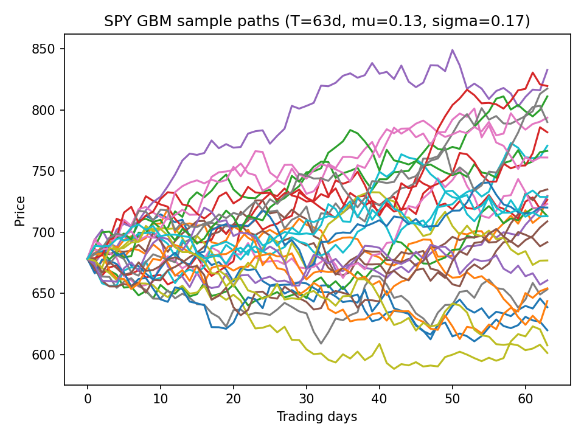
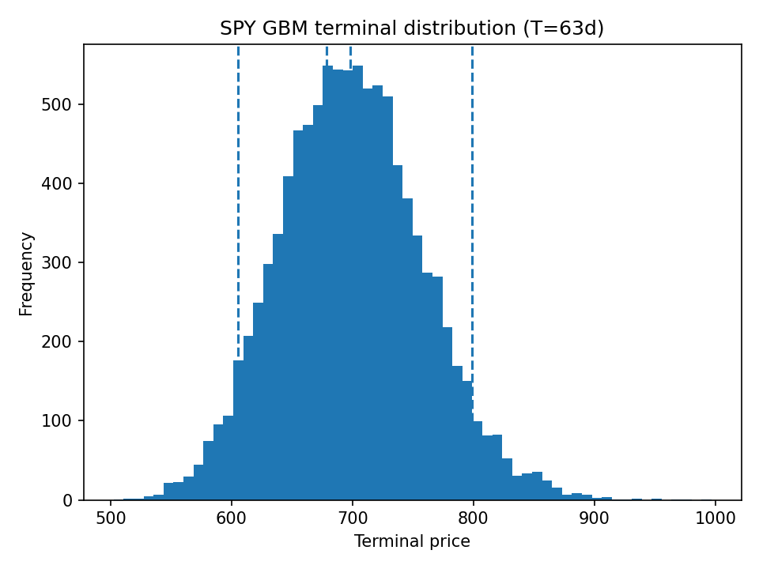
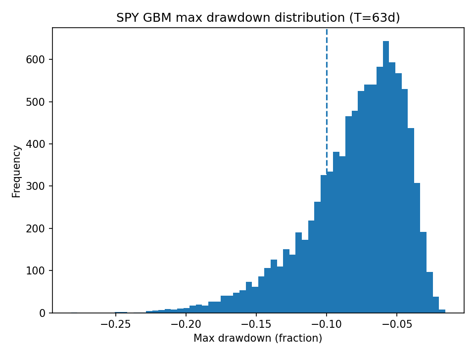

# Quant Foundations

Weekly self-study projects to build quant fundamentals through **theory + implementation**:
- Monte Carlo
- Estimation
- Confidence intervals
- Convergence
- Correlation & covariance modeling (Cholesky decomposition)
- GBM simulation & scenario analysis (calibrated from real market data)

## Skills demonstrated
- Monte Carlo estimators and validation (LLN/CLT intuition in code)
- Standard error + 95% confidence intervals + coverage checks
- Vectorized NumPy workflows and clean script structure (`main()`, functions, reproducibility via seeds)
- Correlated random variable simulation (correlation matrix, Cholesky factorization, validation via empirical moments)
- Linear algebra applied to quant modeling (matrix factorization, vectorized generation of multivariate normals)
- Market data ingestion + calibration (yfinance → log returns → annualized μ/σ)
- Scenario simulation & path-dependent risk (GBM paths, terminal percentiles, loss probability, max drawdown probability)

## Environment
- Python (virtual environment in `.venv/` — gitignored)
- Key libraries: `numpy`, `pandas`, `scipy`, `matplotlib`, `yfinance`

## Repository structure
- `week01_monte_carlo/` — Monte Carlo fundamentals:
  - `monte_carlo_pi.py`: π estimation + SE + CI
  - `normal_moments.py`: estimates of E[X], E[X²], Var(X) + SE/CI
  - `convergence_experiments.py`: empirical 1/√N convergence + diagnostic ratio
- `common/` — reusable utilities (WIP)
- `week02_correlated_normals/` — Correlated normals + Cholesky:
  - `correlated_normals.py`: generate correlated normals via formula and Cholesky; validate mean/variance/correlation
- `week03_spy_gbm/` — SPY GBM calibrated simulator + report:
  - `fetch_data.py`: download SPY data (yfinance) and save CSV
  - `calibrate.py`: compute log returns and estimate μ/σ
  - `report.py`: simulate paths, compute terminal percentiles + drawdown probability, save plots
  - `outputs/`: saved PNG plots

## Setup
Activate venv (PowerShell):
```powershell
.\.venv\Scripts\Activate.ps1
```

## Install dependencies (if needed)
```powershell
pip install -r requirements.txt
```

## Run scripts (Week 1)
From repo root:
```powershell
python .\week01_monte_carlo\monte_carlo_pi.py
python .\week01_monte_carlo\normal_moments.py
python .\week01_monte_carlo\convergence_experiments.py
```
## Week 1 Sample output

### Monte Carlo π (N=100000)
- π estimate: **3.14412**
- SE(π): **0.00519**
- 95% CI: **[3.13395, 3.15429]** (contains true π)

### Normal moments (X ~ N(0,1), N=100000)
- E[X] ≈ **0.00097**, SE ≈ **0.00317**, CI contains **0**
- E[X²] ≈ **1.00180**, SE ≈ **0.00447**, CI contains **1**

### Convergence check (E[X²])
- n = 10³ → SE ≈ 0.0437  
- n = 10⁴ → SE ≈ 0.0143  
- n = 10⁵ → SE ≈ 0.00446  
- n = 10⁶ → SE ≈ 0.00141  
(consistent with **SE ∝ 1/√N**)

## Run scripts (Week 2)
From repo root:
```powershell
python .\week02_correlated_normals\correlated_normals.py
```

### Week 2 sanity check
- `correlated_normals.py`: empirical correlation should be close to target `rho` (e.g., 0.7), and Cholesky reconstruction `L @ L.T` should match Σ.

## Run scripts (Week 3)
```powershell
python .\week03_spy_gbm\fetch_data.py
python .\week03_spy_gbm\calibrate.py
python .\week03_spy_gbm\report.py
```

## Week 3 results (SPY GBM scenarios)
- Using SPY daily data (2021–2026), calibrated GBM (μ≈0.126, σ≈0.169 annualized) and simulated 10,000 3-month scenarios (63 trading days).
- S0 = 678.27
- Terminal percentiles: p5 = 605.58, p50 = 697.98, p95 = 798.81
- P(S_T < S0) = 0.3703
- P(max drawdown ≤ -10%) = 0.2366

## Week3 output graphs
### Sample paths


### Terminal distribution


### Max drawdown distribution
